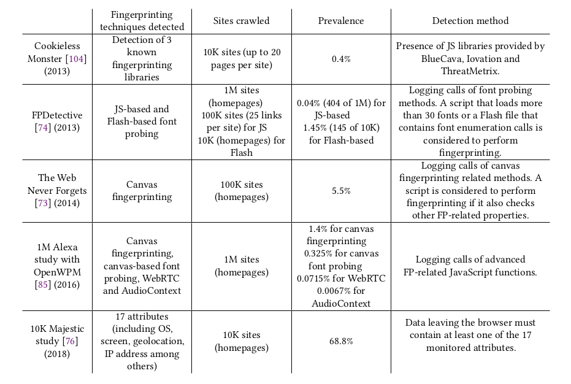
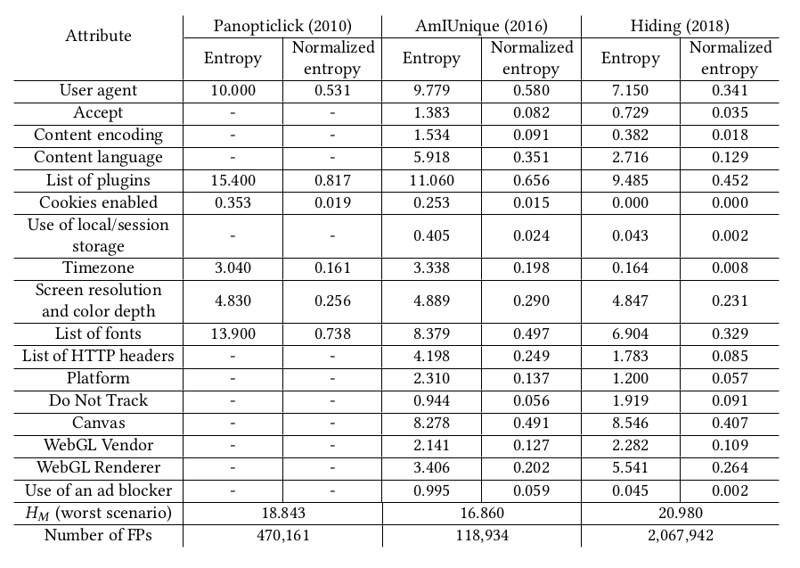

## Введение

Отпечаток браузера (browser fignerprint) -- это набор характеристик браузера и устройства, используемый для его идентификации. 
Предполагается, что можно считать это определением пользователя.

Фингерпринтирг разделяют на 
* активный -- разрешает добавление дополнительных элементов
    взаимодейтсвия только для определения параметров
* пассивный -- использует только заголовки TCP/IP стека 

Также различия могут быть в приоритете
* точность (уникальность)
* неизменность (со временем или при переходе в другой браузер)

Сейчас для определения "личности" пользователя используются cookie.
Кроме обычных есть и более сложные для очищения варианты, например,
PNG Cookies, Silverlight Cookies, но все они основаны на сохранении
некоторых данных на компьютере, что работает в режиме инкогнито.
Также любые сохранные данные можно не только удалить, но и подменить
во вредноносных целях.

Доля использования отпечатков растет ([7], [8]), однако она все еще не велика,
в 2020 около 10% из топ 100 тысяч сайтов по посещаемости.

Не смотря на различные исследования, на практике используются небольшие решения.

## Использование фингерпринтига

* идентификация неавторизованных пользователей
* для восстановления куки
* для определения статистики уникальных пользователей
* для защиты личной информации. Зная отпечаток обычного устройства владельца доступа, можно определить потенциальную утечку данных [17]
* для определения вредноносной активности. Машины и приложения для генерации актиности 
    можно определить по отличительным чертам, например, ip и предположительный замененный user-agent. [2], [9], [10]

[todo]

## Минимальный отпечаток

В одной из первый статей[1] (2010) отпечаток состоял только из 8 параметров браузера и устройства:
1. UserAgent
2. HTTP ACCEPT headers
3. Cookies enabled?
4. Screen resolution
5. Timezone
6. Browser plugins, plugin versions and MIME types
7. System fonts
8. Partial supercookie test
На тот момент он давал хорошие результаты -- 83.6 % точности. Основная проблема была с 
мобильными утройствами, особенно айфонами, которая осталась и до сих пор. На десктопах точность достигала 90%
Интересно, что авторы заметили очень низную ценность считывания системных штрифтов, хотя позже мы увидим,
что в настоящее время они достаточно важны.
Также в статье был предложен простой алгоритм определения наследуемости фингерпринта, но 
справлялся достигать точности в 99%

В работе 2012 года[4] заметили, что показатели с наибольшей важностью -- system fonts, browser plugins, and user-agent strings.
Использовали ML подход.

Для определения уникальности полученного фингерпринта используют энтропию H(X) = - \sum P (x_i) \log_b ( P (x_i) ), 
где X -- набор параметров, P(x) -- вероятность значения x

В работе 2019 года [11] собрали информацию о весе используемых параметров в трех известных реализациях 

можно заметить, что наиболее весомыми признаками являются canvas отпечаток, списки шрифтов и плагинов, user agent.
Также нужно обратить внимание, что на большом датасете (как в [15]) точность все еще достаточно мала (36%).

## Возможные модификации

Так как для фигнерпринтинга можно использовать любые характеристики, существует множество
работ посвещенных рассмотрению новых варинтов определения пользовательского окружения.
Составляющие, которые сейчас есть почти во всех используемых реализациях. Как видно из таблицы 1, они имеют высокуют энтропию
1. canvas fingerprint. Canvas API предоставляет возможность для обработки 2D изображений. Результат обработки случайного изображения, составленного специально максимально отличающимся на разных конфигурациях.
В 2016 году [5] был скроулен миллион сайтов на предмет способов отслеживания пользователей. Значительная часть сайтов использовала только этот вариант расширения.

2. font fingerprint. Список всех установленных в системе штрифтов невозможно получить только с помощью Java Script.
Для этого могут использоваться разные подходы. Например, определение формы области занимаемой текстом, для набора надписей
в шрифтах различных семей. [6]

3. audio fingerprint. Web Audio API предоставляет интерфейс для обработки аудио в виде пайплайна. Аналогично с  canvas fingerprint можно рассматривать результат обработки специфического фрагмента как отпечаток уникальных настрок устройства. [8]

В [19] было показано, что устройства без поддержки java script все еще слабо различимы, около 29% против 89%.

В [20] предлагается подход основанные на показателях производительности инструкций на JS, что подходит для случая низкой разрешенной функциональности. 
Это позволяет определить версию браузера и некоторые характеристики устройства. 
Также в этой работе предложен интересный вариант анализа расширений. К отпечатку предлагается добавлять списков сайтов добавленных в белый лист для использования 
JS (на примире плагина NOScript для Googlee Chrome). 

#### WebGL 
WebGL -- API для обработки 3D графики в бразуре. Он может быть использован для получения информации об устройстве (vendor, renderer) как в [11]
или аналогично с Canvas API, как в [16], этот подход имеет высокую энтропию и может сочетаться с предыдущими.

#### Emodji 
В canvas fingerprint могут также быть добавлены emodji. Пример из [19]

#### Неизменность
В [13] рассмотрен вопрос сохранения отпечатка при смене браузера. Это важное направление, так как более 70% пользователей используют хотя бы два браузера.
В работе смогли достичь 91% стабильности и 99% уникальности отпечатка. 

## Существующие решения
[todo]
* Panopticlick (2010)
* AmIUnique
* FingerprintJS

## Блокировка фингерпринтов 

Конечно, большое количество пользователей и компаний опасается использования отпечатков 
для длительного отслеживания действий в интернете.  
Например, Safari[3] и Firefox[21] защищают пользователей от идентификации подобным образом образом. Также существуют браузеры 
ориентированные специально на защитку от фингерпринтинга (Brave browser, )
Существует множество плагинов для блокировки снятия отпечатков, генераторы случайных параметров и прочее. 
[14],  

## Источники

1. How Unique Is Your Web Browser?, 2010 Peter Eckersley  
2. Пассивный фингерпринтинг для выявления синтетического трафика, [link](https://habr.com/ru/post/241309/)
3. [link](https://www.howtogeek.com/fyi/safari-battles-browser-fingerprinting-and-tracking-on-macos-mojave/)
4. Browser Fingerprinting, 2012 ERIK FLOOD, JOEL KARLSSON
5. Steven Englehardt and Arvind Narayanan. Online tracking: A 1-million-site mea-surement and analysis
6. Browser fingerprinting Master’s Thesis, 2018 Peter Hraška
7. [link](https://www.zdnet.com/article/a-quarter-of-the-alexa-top-10k-websites-are-using-browser-fingerprinting-scripts/)
8. Online Tracking:A 1-million-site Measurement and Analysis, [link](https://webtransparency.cs.princeton.edu/webcensus/)
9. [link](http://www.gm.fh-koeln.de/~krumnow/fp_bot/index.html)
10. [link](https://dataprot.net/statistics/two-factor-authentication-statistics/)
11. Browser Fingerprinting: A survey
12. The Web Never Forgets: Persistent Tracking Mechanisms in the Wild
13. (Cross-)Browser Fingerprinting via OS andHardware Level Features
14. [link](https://chrome.google.com/webstore/detail/canvas-fingerprint-defend/lanfdkkpgfjfdikkncbnojekcppdebfp?hl=ru)
15. Hiding in the Crowd: an Analysis of the Effectiveness ofBrowser Fingerprinting at Large Scale
16. Pixel Perfect: Fingerprinting Canvas in HTML5
17. Device Fingerprinting for Augmenting Web Authentication:Classification and Analysis of Methods
18. o Extend or not to Extend: on the Uniqueness of Browser Extensions and Web Logins
19. Beauty and the Beast: Diverting modern web browsers to build unique browser fingerprints
20. Fingerprinting Information in JavaScript Implementations
21. [link](https://www.mozilla.org/en-US/firefox/features/block-fingerprinting/)
22. Fast and Reliable Browser Identification with JavaScript Engine Fingerprinting